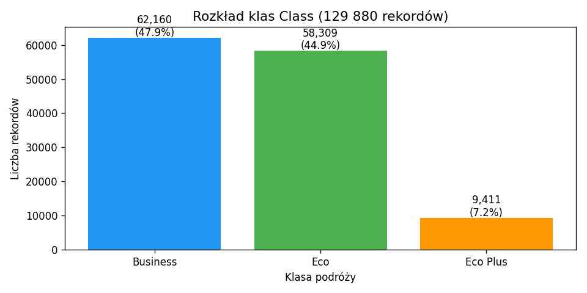
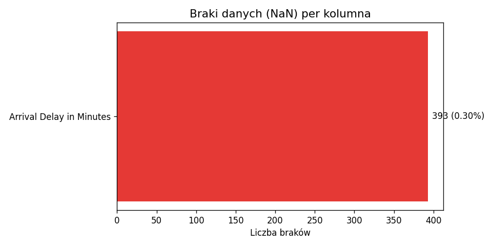
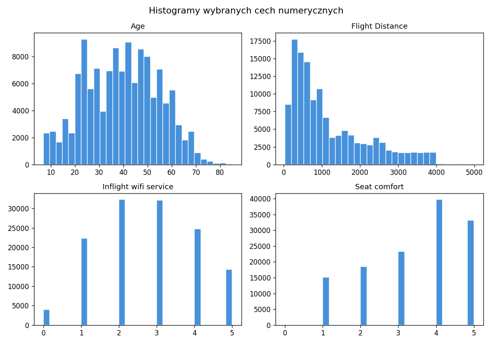
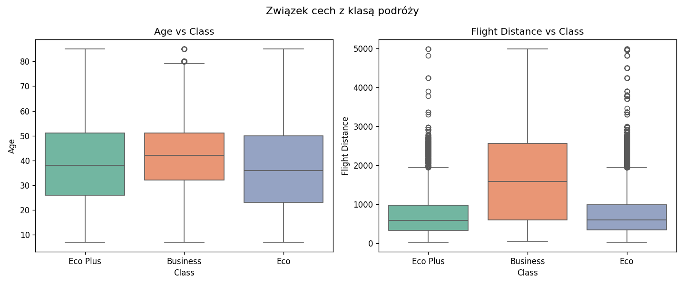
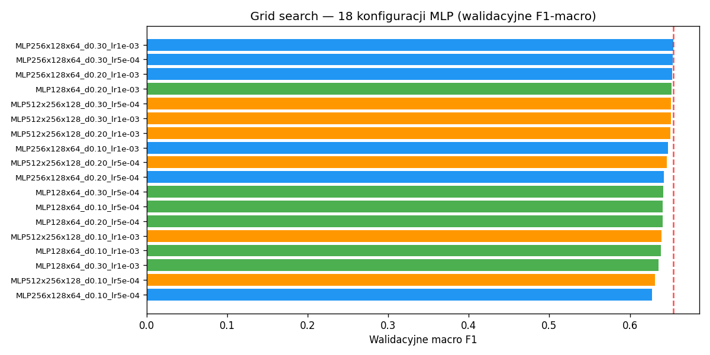
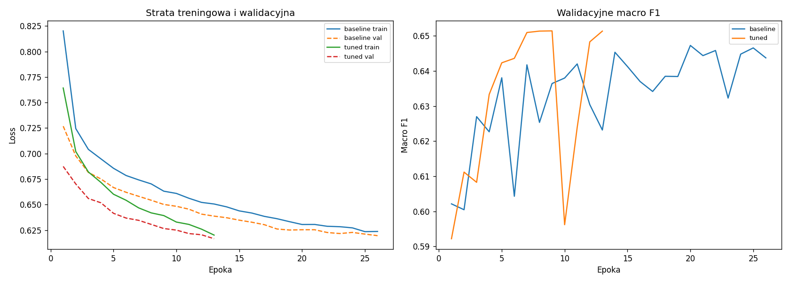
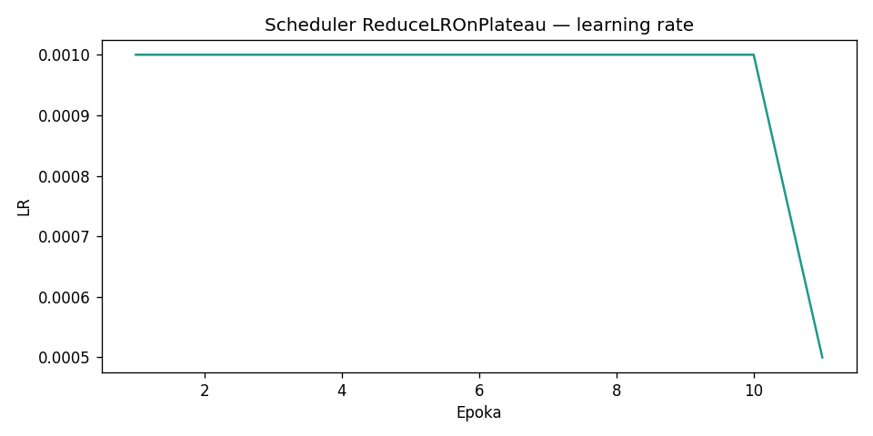
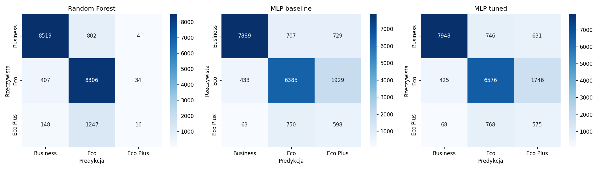

# Airline Passenger Satisfaction — MLP Classifier

> 🚀 **Multiclass flight-class prediction with a PyTorch MLP built from scratch** - benchmarked against Random Forest on 129,880 passenger records, with a leakage-free 70/15/15 protocol

A multiclass classification project predicting `Class` (**Business** / **Eco** / **Eco Plus**) on the [Airline Passenger Satisfaction](https://www.kaggle.com/datasets/teejmahal20/airline-passenger-satisfaction) dataset from Kaggle. The main model is a multilayer perceptron implemented from scratch in **PyTorch**; a scikit-learn **Random Forest** serves as the reference model.

The project is as much about method as about scores. Preprocessing is fitted on the training split alone, hyperparameters are selected on a dedicated validation split via an 18-configuration grid search, and the test split is touched exactly once at the end. The imbalanced minority class (`Eco Plus`, ~7%) is addressed with class weights in the loss rather than resampling — which is precisely why the MLP loses on accuracy and wins on F1-macro.


---

## 🎯 Key Features

- 🧠 **MLP from scratch in PyTorch** — `Linear → BatchNorm1d → ReLU → Dropout` blocks, AdamW, `CrossEntropyLoss` with class weights, `ReduceLROnPlateau` and early stopping on validation F1-macro.
- 🔍 **18-configuration grid search** — 3 architectures × 3 dropout rates × 2 learning rates, all selected on the **validation** split only.
- 🌲 **Random Forest reference** — a scikit-learn baseline evaluated under exactly the same split and metrics.
- 🔒 **No data leakage by construction** — imputers, `OneHotEncoder` and `StandardScaler` are `fit` on train only, then `transform`ed onto val and test.
- ⚖️ **Minority-class handling without resampling** — class weights in the loss instead of SMOTE/oversampling, per the project requirement.
- 🧹 **Domain-aware cleaning** — implausible ages, distances, delays and service ratings are converted to NaN before median/mode imputation.
- ⚡ **Automatic device selection** — CUDA, Apple MPS or CPU, detected at runtime.
- 📊 **Eight generated figures** — EDA, training dynamics, LR schedule, grid search and side-by-side confusion matrices.
- 🖥️ **Streamlit dashboard** — five tabs, including a button that runs the whole experiment from the UI.

---

## 📊 Results & Visualizations

All figures below are regenerated by `python3 run_experiment.py` into `results/airline/plots/`.

### Exploratory data analysis

| Class distribution | Missing data |
|---|---|
|  |  |

| Feature histograms | Features vs. class |
|---|---|
|  |  |

### Model selection and training dynamics

| Grid search comparison | Loss and F1 history |
|---|---|
|  |  |

| Learning-rate schedule | Confusion matrices |
|---|---|
|  |  |

### Results on the test set (19,483 samples)

Source: `results/airline/model_comparison.csv`.

| Model | Accuracy | Precision macro | Recall macro | F1-macro |
|-------|----------|-----------------|--------------|----------|
| MLP baseline | 0.7633 | 0.6462 | 0.6666 | 0.6390 |
| **MLP tuned** | 0.7750 | 0.6497 | 0.6705 | **0.6465** |
| Random Forest | **0.8644** | 0.6791 | 0.6248 | 0.6058 |

**Best configuration** (`run_metadata.json`, selected on validation F1-macro = 0.6536): `MLP256x128x64_d0.30_lr1e-03` — hidden sizes **256×128×64**, dropout **0.3**, learning rate **1e-3**.

### Classification reports (detailed)

Below are the detailed per-class reports for the 3 models, from `results/airline/classification_report_*.txt`.

#### MLP baseline

```text
              precision    recall  f1-score   support

    Business       0.94      0.85      0.89      9325
         Eco       0.81      0.73      0.77      8747
    Eco Plus       0.18      0.42      0.26      1411

    accuracy                           0.76     19483
   macro avg       0.65      0.67      0.64     19483
weighted avg       0.83      0.76      0.79     19483
```

#### MLP tuned

```text
              precision    recall  f1-score   support

    Business       0.94      0.85      0.89      9325
         Eco       0.81      0.75      0.78      8747
    Eco Plus       0.19      0.41      0.26      1411

    accuracy                           0.77     19483
   macro avg       0.65      0.67      0.65     19483
weighted avg       0.83      0.77      0.80     19483
```

#### Random Forest

```text
              precision    recall  f1-score   support

    Business       0.94      0.91      0.93      9325
         Eco       0.80      0.95      0.87      8747
    Eco Plus       0.30      0.01      0.02      1411

    accuracy                           0.86     19483
   macro avg       0.68      0.62      0.61     19483
weighted avg       0.83      0.86      0.84     19483
```

### What do these results tell us (plainly)?

- `Business`: all models work very well.
- `Eco`: Random Forest has very high `recall` (0.95), but at the expense of the `Eco Plus` class.
- `Eco Plus`: the MLP (recall ~0.41-0.42) detects this class much better than RF (recall 0.01).
- That is why RF has higher `accuracy` but a worse `F1-macro` than the MLP tuned.

### Conclusions

1. **MLP tuned wins on F1-macro** — it balances the classes better thanks to class weights.
2. **RF wins on accuracy**, but almost ignores Eco Plus (recall ~1%).
3. **Eco Plus** is a problematic class (~7%) — the MLP reaches recall ~41%.
4. **Class weights in the loss** are key to detecting the minority class.
5. **Limitations:** the small Eco Plus class, no feature engineering, a grid search of 18 configurations.

---

## 🏗️ Pipeline


### Data

| Item | Value |
|---------|--------|
| Source | [Kaggle — Airline Passenger Satisfaction](https://www.kaggle.com/datasets/teejmahal20/airline-passenger-satisfaction) |
| Local files | `data/train.csv`, `data/test.csv` |
| `data/train.csv` (Kaggle) | **103,904** records |
| `data/test.csv` (Kaggle) | **25,976** records |
| **Total (used in the project)** | **129,880** records |
| After the 70/15/15 split | train **90,915** / val **19,482** / test **19,483** |
| Target | `Class` (Business ~48%, Eco ~45%, **Eco Plus ~7%**) |

> **Note:** "~105k" usually refers to the `train.csv` file alone (~104k), while "~130k" is **train + test** combined. These are not contradictory numbers — they are **different stages** (Kaggle files vs the split in the experiment).

#### Dropped columns

- `Unnamed: 0` — an artificial CSV index
- `id` — a passenger identifier
- `satisfaction` — the original binary target (we do not use it)

#### Features (18 numeric + 3 categorical)

- **Numeric:** Age, Flight Distance, 14 service ratings (scale 0–5), Departure Delay, Arrival Delay
- **Categorical:** Gender, Customer Type, Type of Travel

Together with one-hot expansion this yields **24 input features** to the model.

### Preprocessing (`airline_project/preprocessing.py`)

1. **Removing unrealistic values** (`remove_unrealistic_values`):
   - Age < 0 or > 100 → NaN
   - Flight Distance ≤ 0 → NaN
   - Delays < 0 or > 1440 min → NaN
   - Service ratings < 0 or > 5 → NaN
2. **Imputing missing values:**
   - Median (numeric), mode (categorical)
   - Fit **on train only** — no data leakage
3. **OneHotEncoder** — categorical → binary columns
4. **StandardScaler** — numeric → z-score (fit on train)
5. **Split:** 70% train / 15% val / 15% test, stratified by target

### How train / val / test work (step by step)

Val is not a "final test" but a **control during learning**.

```
All data (after combining train.csv + test.csv from Kaggle)
        │
        ├── 70% TRAIN   → the model LEARNS (updates weights)
        ├── 15% VAL     → control DURING training (does not update weights)
        └── 15% TEST    → the FINAL exam (only at the very end, once)
```

**Order in the project:**

1. **Preprocessing** — parameters (mean, median, one-hot) computed **on train only**, then the same applied to val and test.
2. **Grid search (18 MLP variants)** — each variant:
   - learns on **train (70%)**,
   - is checked every epoch on **val (15%)**,
   - we pick the best variant by **F1-macro on val**.
3. **Training baseline and tuned** — again train + val (early stopping, LR scheduler).
4. **Only at the end** — evaluating **baseline, tuned and Random Forest** on **test (15%)** → reports, the table above, charts.

**Val (15%) is used for:**

- early stopping (when to stop training),
- reducing the learning rate (the `scheduler_lr.png` chart),
- selecting the best configuration from the grid search.

**Test (15%)** — the model was **not** used on it when choosing hyperparameters. It is a fair final result.

**Important:** val **does not replace** the test. Val = many times during training. Test = **once** at the end.

---

## 🔒 Protection Against Data Leakage

**Data leakage** = the model or preprocessing **gets a hint from the test set or from the answers** before we do the final evaluation. Then the test result is **too high** and **not credible**.

**Analogy:** you saw the exam questions in advance — the grade does not reflect real knowledge.

### A live example: scaling Age

Suppose the mean age on **train** = 40 and on **test** = 60.

**Wrong (leakage):**

1. You compute the mean from **train + test** together → e.g. 45.
2. You scale all rows with that mean.
3. The model "knows" indirectly that the test contains older passengers (because the mean of 45 includes the test).

**Right (no leakage — as we do it):**

1. **`fit` on train:** mean = 40, std from train.
2. **`transform` on test:** age 60 → `(60 - 40) / std_train` — the test does not change the mean, it only uses the parameters from train.

The same applies to: the median for missing values, OneHot (which categories exist), the grid search (which model to pick).

### How can data leak?

| Mistake | What you do wrong | Consequence |
|------|----------------|--------|
| Preprocessing on all data | `fit` on train+test+val together | The test "enters" the mean, median, one-hot |
| Training on the test | Weights learn on the 15% test | The test is no longer unseen |
| Selecting a model on the test | Grid search: "best" = highest score on test | The test is used for tuning |
| `satisfaction` in the features | The model sees satisfaction when predicting `Class` | A hint (cheating) |
| `Class` in feature preprocessing | E.g. scaling using the label | The direct answer in the features |

### What we do in this project (the order — no leakage)

```
1. Combine train.csv + test.csv from Kaggle  →  129,880 rows
2. Split 70% / 15% / 15%                      →  train / val / test
3. Fit preprocessing ONLY on train            →  median, scaler, one-hot
4. Transform on val and test                  →  the same parameters, no fit
5. Train the MLP on train                     →  weights from train
6. Control on val                             →  early stopping, LR, grid search
7. ONE evaluation on the test                 →  reports (0.76, 0.77, 19483 samples)
```

| Step | Set | Can it leak? | Here |
|------|-------|----------------------|-------|
| Mean age, median of delays | train only at `fit` | Yes, if you compute it with the test | **No** — train only |
| Scaling val/test | transform | Yes, if you `fit` again | **No** — transform only |
| Which MLP to pick (grid) | val | Yes, if done on test | **Val** |
| Accuracy / F1 report | test | Yes, if you tuned on test first | **Test only at the end** |
| The `satisfaction` column | — | Yes, as a feature | **Removed** |
| The `Class` target | only as y | Yes, in the features X | **Only y, not in X** |

### `fit` vs `transform` — the simplest version

| Word | In plain terms | When |
|-------|-----------|--------|
| **fit** | "learn the parameters" | On **train (70%)** only — e.g. the median of Age, the mean for the scaler |
| **transform** | "apply those parameters" | On **val** and **test** — without recomputing |

**Leakage would be:** `fit` on the whole dataset or on train+test.
**Here:** `fit_preprocessor(train_df)` in `preprocessing.py`, then `transformuj_cechy(val/test, ...)`.

### Where in the code?

```text
preprocessing.py
  fit_preprocessor(train_df)     ← fit ONLY on train
  transformuj_cechy(val_df)      ← transform
  transformuj_cechy(test_df)     ← transform

experiment.py
  trenuj_mlp(..., x_train, y_train, x_val, y_val)   ← training + val
  przewidz_mlp(..., x_test)                         ← test at the end
```

**For the defense (one sentence):**
"Leakage is when the test or the answer influences training. Here we fit preprocessing on train, tune the model on val, and use the test only once for the final report."

---

## 🧩 MLP Model (`airline_project/model.py`)

### Hidden-layer architecture

```
Linear → BatchNorm1d → ReLU → Dropout
```

- **Linear** — a linear transformation (learned weights + bias)
- **BatchNorm1d** — batch normalization (training stabilization)
- **ReLU** — a non-linear activation max(0, x)
- **Dropout** — regularization (random neuron zeroing)

The output layer has **3 neurons** (`output_dim=3`), one per class of the `Class` target.

### Training components

| Component | Description |
|---------|------|
| Optimizer | AdamW (weight_decay=1e-4) |
| Loss | CrossEntropyLoss with **class weights** |
| Scheduler | ReduceLROnPlateau (factor=0.5, patience=3) |
| Early stopping | Validation macro F1 (patience=5, min_delta=1e-4) |
| Batch size | 1024 |
| GPU | Automatic CUDA / MPS / CPU detection |

### Grid search (18 configurations)

| Parameter | Values |
|----------|----------|
| Architecture | (128,64), (256,128,64), (512,256,128) |
| Dropout | 0.1, 0.2, 0.3 |
| Learning rate | 1e-3, 5e-4 |

**Baseline:** `baseline_MLP128_64` — (128,64), dropout=0.2, lr=1e-3, max_epochs=35, patience=6.
**Tuned:** the best from the grid — `MLP256x128x64_d0.30_lr1e-03`, max_epochs=30, patience=5.

Full per-configuration results are in `results/airline/grid_search_results.csv`.

---

## 🛠️ Technology Stack

### Deep Learning
- **PyTorch** (`>=2.0,<3`) — the MLP, AdamW, `CrossEntropyLoss` with class weights, `ReduceLROnPlateau`, CUDA/MPS/CPU device selection

### Machine Learning
- **scikit-learn** (`>=1.3,<2`) — `RandomForestClassifier` reference model, `OneHotEncoder`, `StandardScaler`, stratified splitting and the metrics suite
- **NumPy** (`>=1.24,<3`) — numeric arrays

### Data & Visualization
- **pandas** (`>=2.0,<3`) — loading, cleaning, results tables
- **Matplotlib** (`>=3.7,<4`) and **seaborn** (`>=0.13,<1`) — all eight generated figures

### UI & Documentation
- **Streamlit** (`>=1.28,<2`) — the five-tab dashboard
- **Jupyter** / **ipykernel** — the accompanying notebook in `docs/`
- **python-docx** (`>=1.1,<2`) — documentation generation

---

## 🚀 Getting Started

### Prerequisites

- **Docker** — for the containerised path below (recommended)

- **Python 3.10+**
- Both Kaggle CSVs present at `data/train.csv` and `data/test.csv`

### Run with Docker (recommended)

The container installs the scientific stack, runs the experiment and serves the
dashboard in one step — no local Python setup and no virtual environment:

```bash
docker compose -f .tools/docker/docker-compose.yml up --build
```

The dashboard is then available at **http://localhost:8501**.

Generated artefacts (`results/`, `data/`) are bind-mounted back to the host, so
charts and metrics written inside the container survive it being removed. Stop
the stack with:

```bash
docker compose -f .tools/docker/docker-compose.yml down
```

### 1. Clone the Repository

```bash
git clone https://github.com/dawidolko/Airline-Passenger-Classifier-Python-MLP-Classifier-Python.git
cd Airline-Passenger-Classifier-Python-MLP-Classifier-Python
```

### 2. Install Dependencies

```bash
pip install -r requirements.txt
```

### 3. Run

```bash
# experiment only (training + evaluation + charts):
python3 run_experiment.py

# Streamlit dashboard:
streamlit run streamlit_app.py
```

#### One-command start scripts

`start.sh` (macOS/Linux) and `start.bat` (Windows) create or repair `.venv`, install the requirements, run `python run_experiment.py`, then launch Streamlit at **http://localhost:8501**.

```bash
chmod +x start.sh
./start.sh
```

```cmd
start.bat
```

### Streamlit dashboard

| Tab | Content |
|---|---|
| **Summary** | Best model, F1-macro, accuracy and the compute device used |
| **Reports** | Per-class classification reports for all three models |
| **Charts** | The eight generated figures |
| **Conclusions** | Interpretation of the comparison |
| **Files** | Generated artifacts under `results/airline/` |

The sidebar **"Run the full experiment"** button launches training directly from the UI.

---

## 📁 Project Structure

```
Airline-Passenger-Classifier-Python-MLP-Classifier-Python/
├── 🧠 airline_project/
│   ├── __init__.py
│   ├── config.py          # Paths, hyperparameters, feature lists, seed (42)
│   ├── model.py           # The AirlineMLP class + device selection
│   ├── preprocessing.py   # Cleaning, splitting, imputation, scaling
│   └── experiment.py      # Grid search, training, evaluation, charts
├── 📊 data/
│   ├── train.csv          # Kaggle train file (103,904 records)
│   └── test.csv           # Kaggle test file (25,976 records)
├── 📈 results/airline/
│   ├── model_comparison.csv
│   ├── grid_search_results.csv
│   ├── run_metadata.json
│   ├── classification_report_mlp_baseline.txt
│   ├── classification_report_mlp_tuned.txt
│   ├── classification_report_random_forest.txt
│   └── plots/
│       ├── class_distribution.png
│       ├── missing_data.png
│       ├── feature_histograms.png
│       ├── features_vs_class.png
│       ├── grid_search_comparison.png
│       ├── loss_and_f1_history.png
│       ├── scheduler_lr.png
│       └── confusion_matrices_side_by_side.png
├── 📚 docs/
│   ├── diagrams/pipeline.svg
│   ├── airline_passenger_satisfaction_mlp_project2.ipynb
│   └── dokumentacja_do125148.docx
├── ▶️ run_experiment.py    # CLI entry point
├── 🖥️ streamlit_app.py     # Streamlit dashboard
├── 🚀 start.sh / start.bat # Experiment + dashboard
├── 📦 requirements.txt
└── 📖 README.md
```

---

## ❓ FAQ — the most important questions (plainly)

### Where do the numbers 129k, ~105k and 19,483 come from?

| What you see | Number | What it means |
|------------|--------|--------------|
| `data/train.csv` | **103,904** | A separate Kaggle file (~104–105k) — **not** the same as "train 70%" in the model |
| `data/test.csv` | **25,976** | The second Kaggle file |
| **All data in the project** | **129,880** | `train.csv` + `test.csv` **combined**, then one 70/15/15 split |
| Train in the model (70%) | **90,915** | This is where the model **learns** |
| Val (15%) | **19,482** | Control during training |
| Final test (15%) | **19,483** | The **final exam** — hence `19483` in the reports |

**There is no error:** ~105k is the Kaggle train file, ~130k is the sum of both files, ~91k is the train **inside** the experiment, ~19.5k is the final test.

### Why does a report show `satisfied` / `neutral or dissatisfied`?

If in the documentation you see the classes **`satisfied`** and **`neutral or dissatisfied`** instead of **Business / Eco / Eco Plus**, that is an **old chart/screenshot** (the original Kaggle target `satisfaction`), **not** a result of this project.

In this project the reports are for **`Class`** — see `results/airline/classification_report_*.txt` or the classification reports above.

### Why do we drop `Unnamed: 0`, `id`, `satisfaction`?

- `Unnamed: 0` is a technical row number from the CSV, not a feature.
- `id` is a passenger identifier; the model should not learn from numbers.
- `satisfaction` is a different target (satisfied/dissatisfied). In this project the target is `Class`.

### `satisfaction` vs `Class` — what we do not use

The CSV has **two separate columns**:

| Column | Meaning |
|---------|-----------|
| `satisfaction` | Whether the passenger is satisfied: `satisfied` or `neutral or dissatisfied` |
| `Class` | The flight class: `Business`, `Eco`, `Eco Plus` |

These are **not the same** (you can be satisfied in Eco or dissatisfied in Business).

- We **drop** the `satisfaction` column from the input features — the model does not see it.
- We **keep** `Class` as the answer (target) to learn.
- Rows with `satisfied` and `neutral or dissatisfied` **stay** — we use their other columns.
- `Class` **does not replace** `satisfaction` — from the start we predict the travel class, not satisfaction.

### How do we encode categorical features (3 → 6 columns)?

3 text columns: `Gender`, `Customer Type`, `Type of Travel`.

**OneHotEncoder** — each value gets its own 0/1 column, e.g. `Gender_Male=1`, `Gender_Female=0`.

| Source | Values | Columns after encoding |
|--------|----------|---------------------|
| Gender | 2 | 2 |
| Customer Type | 2 | 2 |
| Type of Travel | 2 | 2 |
| **Total** | **3** | **6** |

Together with the 18 numeric features → **24 input features** to the model.

### Numeric features — are they "converted"?

**Not** into categories. The 18 columns stay numeric: cleaning → imputing missing values (median) → **StandardScaler** (scaling). One-hot applies **only** to the categorical features.

### Why is accuracy 0.7633 in the table but 0.76 in the report?

It is the **same value**, only rounded differently:

- `model_comparison.csv` — the full number (e.g. 0.7633),
- `classification_report_*.txt` — rounded to 2 decimals (0.76).

There is no contradiction — the report is just visually "flatter".

### What does `accuracy` with the number 19483 in the report mean?

- **19483** = the number of all samples in the **test** (total support),
- **accuracy** (e.g. 0.76) = a **single** metric: the % of all correct predictions across the 3 classes combined.

There are separate rows per class (Business, Eco, Eco Plus). This is **3-class** classification, not binary (2 values).

### How to read the LR chart (`scheduler_lr.png`)?

- **LR (learning rate)** = the step size when updating the weights.
- At the start the LR is larger, to train the model faster.
- When **F1 on val** stops growing → `ReduceLROnPlateau` lowers the LR (usually by half).
- On the chart you can see "steps" going down — this is normal and desirable.
- The idea: a large step at the start, a smaller step at the end = more stable model "fine-tuning".

### What does "fit on train, transform on val/test" mean?

- **fit** = compute the preprocessing parameters (mean, std, median, category dictionary) on train.
- **transform** = apply the same parameters to val/test.
- This way there is no data leakage (the model does not peek at the test).

### Why `handle_unknown='ignore'`?

If a category not present in train appears in val/test, the code does not crash.

### Why 70/15/15 instead of 80/20?

- 80/20 is fine if you only train and test.
- Here we tune the model (grid search + early stopping), so a separate **validation set** is needed.
- Hence: 70% train, 15% validation, 15% test.

### Why is `test.csv` ~25k in the files but the test is ~19.5k in the results?

Because we combine `data/train.csv` + `data/test.csv` from Kaggle and then make our own 70/15/15 split. The final test is 15% of the whole, i.e. about 19,483.

### What does `output_dim=3` mean?

We have 3 classes of the `Class` target: `Business`, `Eco`, `Eco Plus`. That is why the last layer has 3 neurons.

### What do the `Linear -> BatchNorm -> ReLU -> Dropout` blocks do?

- `Linear`: computes weighted sums of features.
- `BatchNorm`: stabilizes the values between layers.
- `ReLU`: adds non-linearity (the model becomes "smarter" than a plain line).
- `Dropout`: randomly disables some neurons during training so the model does not overfit.

### What do more layers and neurons give?

A larger network can learn harder relationships, but it overfits more easily. That is why we test several variants and pick the best one.

### What is a grid search?

Automatically checking many parameter combinations (architecture, dropout, learning rate) and choosing the best one by the validation result.

### What is CrossEntropyLoss?

A loss function for multiclass classification. It penalizes the model when it scores the true class low.

### What are class weights?

The rare class (`Eco Plus`) receives a larger penalty for a mistake, so the model focuses on it more.

### What is F1-macro?

F1 computed separately for each class, then averaged. Each class has the same weight.

### What is SMOTE / oversampling?

- **Oversampling**: increasing the number of samples of the minority class.
- **SMOTE**: creating new, synthetic samples of that class.

In this project we do not use this (per the requirement) — we use class weights.

### How do the metrics differ?

- `accuracy`: the percentage of all correct predictions.
- `precision_macro`: how often the model is right when it points to a class.
- `recall_macro`: how many real cases of a class it detected.
- `f1_macro`: a precision/recall compromise, averaged over classes.

### What does `model.eval()` mean?

The model's evaluation mode: dropout is disabled and batchnorm behaves stably.

### What are AdamW, ReduceLROnPlateau, early stopping and an epoch?

- **AdamW**: a weight-update algorithm.
- **ReduceLROnPlateau**: reduces the learning rate when the result stalls.
- **Early stopping**: ends training when there is no improvement for several epochs.
- **Epoch**: one full pass through the entire training set.

---

## 📄 License

This project is open source and available under the terms described in the [LICENSE](LICENSE) file.

---

## 👨‍💻 Author

Created by **[Dawid Olko](https://github.com/dawidolko)**

- **Website** — [dawidolko.pl](https://dawidolko.pl/)
- **LinkedIn** — [@dawidolko](https://www.linkedin.com/in/dawidolko/)
